<!-- Generated by PDF to Markdown Converter v1.1.0 -->

Application Observability for Edge-Deployed Solutions
### Overview
### Background
Pillars of Observability
Edge Observability Design
Data Sources
Data Platform
## Visualization
Proposed Development Plan
## Architecture
OpenT elemetry Collector Pipeline
Pipeline: Receivers
Pipeline: Processors
Pipeline: Exporters
### Helpers
### Extensions
Estimating Storage Requirements
## Configuration
Deployment and Deployment Artifacts
Data Retention
### Metrics
Logs and Traces
### Alerting
Alert Criteria
Communication Mechanism
Service Identification
Instrumentation in W orkloads
Control Tower
## Publishing a custom metric
Application publishes metric (chosen path)
RClone publishes metric (alternative path)
Service-level Indicators
### Dashboard
Capacity Requirements
CPU & Memory
Disk Space
### Overview
In modern distributed systems, observability is crucial for maintaining the health, performance, and reliability of edge-deployed solutions. This document outlines design choices for implementing
### observability at the edge, and addresses the following business objectives:
Proactive Issue Detection and Easier Root Cause Analysis : The observability platform will enable the identification and resolution of potential issues before they impact users. By quickly
### solutions.
| pinpointing the root cause of problems, downtime can be minimized, ensuring that service level objectives | (SLOs) and service level indicators | (SLIs) are consistently met for edge-deployed |
| --- | --- | --- |
Informed Decision-Making : By leveraging metrics, logs, and traces collected from edge devices, stakeholders can make data-driven decisions regarding system improvements and
### resource allocation.
### Improved Operational Efficiency : Centralize monitoring for all HCI clusters and applications in a single unified platform to enhance operational ef ficiency .
### Integration of Deployment Components : Seamlessly integrate deployment components such as GitOps and CI/CD with the central observability platform.
Compatibility with Key T echnologies : Ensure the proposed solution is compatible with Stack HCI, Kubernetes, GitOps-based fleet management, and aligned with Microsoft's observability
### tech stack strategy .
### Optimal Data Flow from Edge to Cloud : As edge might be bandwidth constrained, optimize the flow of the telemetry from edge to observability platform.
Offline Capabilities : The observability platform should be resilient to network outages. It must have the capability to automatically resume data collection and transmission once network
### connectivity is restored, ensuring no critical data is lost during downtime.
### Background
Pillars of Observability
### The purpose of an observability system is to collect, process, and export signals. These signals typically encompass three main components:
### Metrics: Quantitative data  that measures various aspects of a system's performance and health, such as CPU usage, memory consumption, request rates, and error rates.
### Logs : Detailed, timestamped records of events and actions that occur within a system, providing context and insights into the behavior and state of applications and infrastructure.
### dependencies.
| Traces : End-to-end records of requests or transactions | as they propagate through dif ferent services and components in a distributed system, helping to identify performance bottlenecks and |
| --- | --- |
---

### For more information on these pillars and dif ferences between metrics, traces, and logs, please refer to Observability - Engineering Fundamentals Playbook .
Edge Observability Design
### In an edge system, the ability to send telemetry to the cloud for analysis requires 1) instrumented systems and 2) an agent that facilitates gathering and transmitting telemetry data to the cloud.
### Azure Monitor  is the umbrella term for a range of products that provide instrumentation, transportation, storage, alerting, and analysis capabilities.
Data Sources
### For sending telemetry back to cloud, the following options were evaluated:
### depending on the type of signal.
### 2. OpenT elemetry Collector  – A vendor-agnostic open-source component designed to collect, process, and export telemetry data.
### due to its preview status.
## Credits: [company website]/en-us/azure/azure-monitor/overview
- 1.. Azure Monitor Container Insights  – A first-party solution from Microsoft that collects telemetry from edge containers systems and delivers to portfolio of services inside Azure Monitor
- 3.. Azure Monitor Edge Pipeline (preview)  – A first-party solution from Microsoft for building data ingestion pipelines. V ery similar to OpenT elemetry Collector . This product is NOT  considered
Ease of deployment Easy. Enabled as an extension. Medium. Deployed using GitOps-
based workflow. Requires YAML
configuration/management.Container Insights
Supported in Azure only Multi-cloud, on-premise, hybrid. -
Data collection Automatically of predefined
## resources. Collection rules can be
configured as needed.More flexibility. Manual or automatic
instrumentation. Vast array of open-
source collectors available.OpenTelemetry
Storage Azure Monitor Multiple backends including
Application Insights, New Relic,
ElasticSearch, Prometheus, etc.OpenTelemetry Azure Monitor Container InsightsOpenTelemetry Winner

### Images from this page

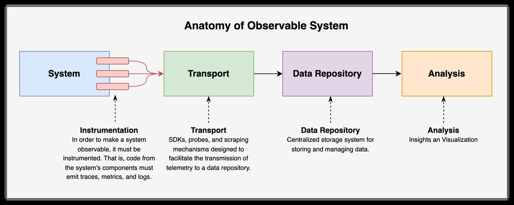

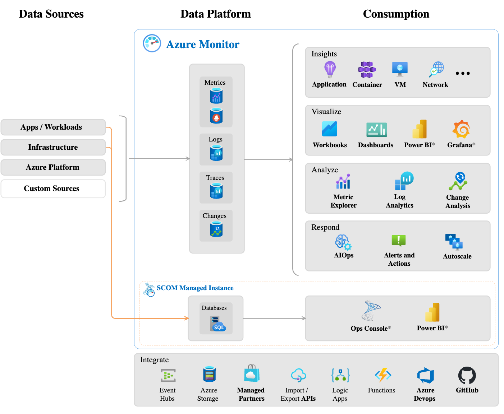

---

## Recommendation
Assessment Criteria
### 1. It's crucial to account for periodic network interruption between edge systems and the cloud.
### 2. Bandwidth limitations: our solution should judiciously transmit telemetry to the cloud. As excessive metric transmission from Edge to cloud might potentially hog the network bandwidth.
### 3. The system should of fer workload visibility with minimal configuration; for instance, enabling telemetry scraping for existing workloads like Spark.
### 4. The observability system should have the capability to enrich the telemetry (e.g., attach PlantId-environment with logs) for improved consolidation in Log Analytics and Grafana.
### Result:
### Based on the criteria, we recommend OpenT elemetry  as the preferred technology .
### OpenT elemetry provides the capability to queue messages in memory or on a file system to handle network interruptions between the edge and Azure, ensuring reliable telemetry transport.
Furthermore, OpenT elemetry of fers flexibility in filtering metrics, logs, and traces, optimizing data transmission by selectively sending specific telemetry types and thereby reducing outbound
### network traf fic from the edge.
Lastly , it should be noted that Microsoft recommends using the OpenT elemetry Collector as a data processing pipeline and is committed to using OpenT elemetery going forwards. You can learn
more about this partnership here: Application Insights OpenT elemetry data collection - Azure Monitor
Data Platform
## A data platform is used for aggregating, analyzing, and visualizing telemetry data to gain insights into system performance, health, and operational ef ficiency . Below is a brief overview of key
### data platforms within Azure Monitor and their capabilities:
### For this engagement, we will utilize all the aforementioned technologies as part of our solution.
## Visualization
## A visualization platform is crucial for translating complex telemetry data into actionable insights and trends through intuitive and informative graphical representations. Below is a brief overview of
visualization platforms within Azure Monitor and their capabilities:Offline storage Not supported. Telemetry is lost
during network disruptions.Disk-based queuing can cache data
locally and sync to cloud when
connectivity is restored.OpenTelemetry
Instrumentation Azure SDK sending telemetry
directly to cloud.OpenTelemetry SDK, scraping and
polling. Community receivers also
make it appealing for Milestone 2 –
Digital Twin workstream.OpenTelemetry
### Managed Identity supportSupported natively Limited, requires AAD Proxy.
Fallback - Use Azure Monitoring
## Agent for exporting metrics to
Prometheus and App Insights
connection string for Logs and
Traces.Container Insights
Azure Monitor
MetricsTime-series database that's optimized for analyzing
### time-stamped data.
Azure Managed
### PrometheusA PromQL interface on top of Azure Monitor Metrics.
Log Analytics Based on Azure Data Explorer, provides a powerful
analysis engine and rich query language KQL.-
## Application
### InsightsHelps developers with correlation.
## Description Metrics Logs Traces
### Existing
dashboards Yes - Yes Yes
### Sharing
dashboardsYes No Yes Yes
### Existing
dashboards and
data source
integrationOut-of-the-box and
public GitHub
templates and
reports. Limited to
Azure Monitor.Limited to Azure
Monitor.Can connect to
various data
sources including
relational and
timeseries
databases. Grafana
has popular plug-Integrate data from
multiple data
sources Workbooks Dashboard Grafana Power BI

### Images from this page

---

A detailed comparison can be found here: Azure Monitor best practices - Analysis and visualizations - Azure Monitor
Proposed Development Plan
## Architecture
### Few notable things:
### controlled and systematic manner .
### Prometheus. Presently AMA  supports only Azure RBAC for authorization. AMA  helps to connect OpenT elemetry with Prometheus with the help of Service Principal.
### a. This necessitates coordination between AIO telemetry collection pipeline as AIO also configures  AMA  agent to pull telemetry .
- 1.. An OpenT elemetry Collector instance will be deployed per environment supporting software development lifecycle (SDLC). This enables the development, testing, and deployment in a
- 2.. Azure Monitor Agent (AMA) will be configured to pull telemetry from OpenT elemetry Collector ’s Prometheus. AMA  is used as an agent in the middle to push telemetry to Azure Managed
- 3.. A Kubernetes service will be deployed to enable OTLP  instrumented workloads to send telemetry to service at <service-name>.<namespace>.svc.cluster.local:4317ins and dashboard
templates for
application
performance
### monitoring (APM).
### Prometheus
supportNo but integration
with Azure Monitor
## Metrics enabled it to
query Prometheus
metrics. - Yes -
Realtime Yes No Yes No

### Images from this page

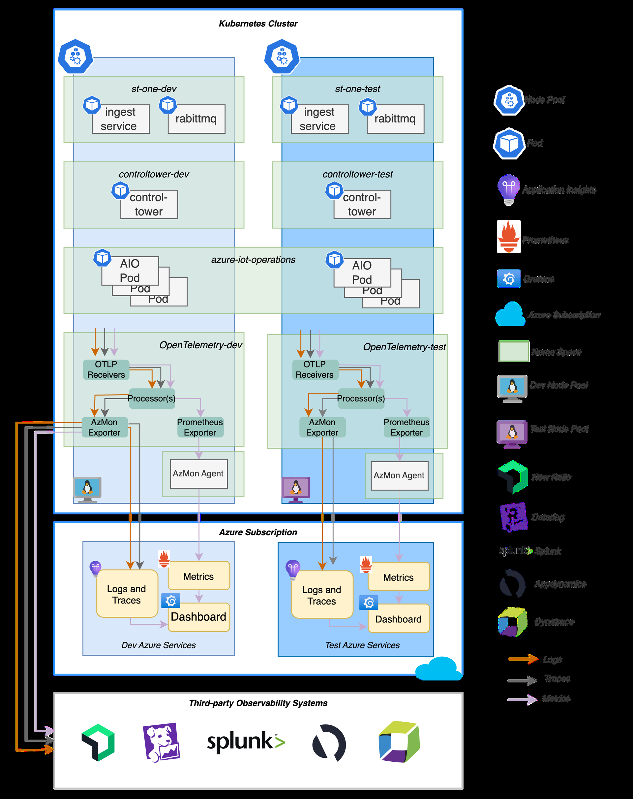

---

### Managed Grafana to Azure Table Storage.
- 4.. Control Tower will publish a custom metric showing the most recent successful telemetry push to Blob storage. This means that no additional configuration will be needed to connect Azure
OpenTelemetry Collector Pipeline
### and exporters  send the processed telemetry data to designated backends or storage systems.
| In OpenT elemetry Collector , receivers | are components that collect telemetry data from various sources, processors | are responsible for transforming, filtering, and enriching the collected data, |
| --- | --- | --- |
Pipeline: Receivers
### For milestone 1, the following receivers will be deployed:
### OTLP  Receiver  - Receives data via gRPC or HTTP  using OTLP  format.
### Kubelet Stats Receiver  - node, pod, container , and volume metrics.
### [TBD] RabbitMQ Receiver  – Receive telemetry information from ST -One’ s RabbitMQ component. Pending a discussion with ST -One.
### For the Digital Twins workstream in Milestone 2, additional receivers may be deployed:
| Kubernetes Cluster Receiver | - collects cluster-level metrics and entity events from the Kubernetes API server |
| --- | --- |
| Apache Spark Receiver | - Metrics for an Apache Spark cluster |
| Kafka Metrics Receiver | - Kafka metrics (brokers, topics, partitions, consumer groups) from Kafka server |
Pipeline: Processors
### For milestone 1, the following processors will be deployed:
### Batch Processor  - Batching helps better compress the data and reduce the number of outgoing connections required to transmit the data.
Pipeline: Exporters
### The following exporters will be deployed:
### Azure Monitor Exporter  - Sends logs, traces and metrics to Application Insights.
### Prometheus Exporter  - Exports data in the Prometheus format, which allows it to be scraped by a Prometheus server—in our case Azure Monitor Agent—at <service-name>.
### <namespace>.svc.cluster.local:8889/metrics .
### [Dev only] Debug Exporter  -  Outputs telemetry data to the console for debugging purposes.
### Helpers
### Exporter Helper  – Retry capabilities with ability to persist metrics and logs to disk.
### Extensions
### File Storage  – Persist state to the local file system.
Credits: https://opentelemetry .io/docs/collector/

### Images from this page

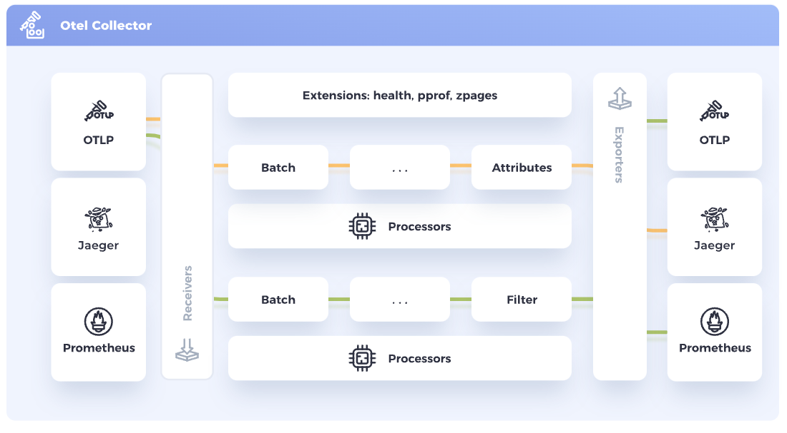

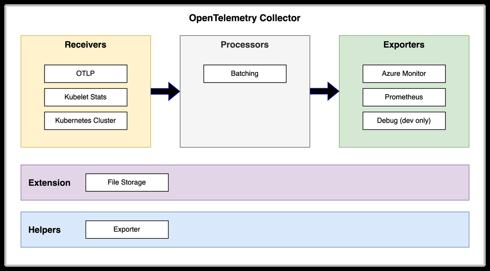

---

Estimating Storage Requirements
### following calculations walkthrough estimating queue size and figuring out appropriate values for timeouts and backof f.
## Estimating storage
### Metrics
| As noted earlier , Exporter Helper | will be deployed to queue messages to disk in case of failures. Configurations must consider both short-term network disruptions and long-term outages. The |
| --- | --- |
One of the chattiest receivers we deploy is the Kubelet Stats Receiver , which broadcasts a payload every 20 seconds. The payload size is proportional to the number of workloads and currently
### then we have   . We can round it up to 1 KB for simplicity .
| includes 64 metrics | in numeric (integers and floats) and string formats. If we estimate that each field on average takes 10 bytes (about 10 characters in utf-8, 4 bytes for float, 8 bytes long, etc.), |
| --- | --- |
Then for 1 hour , data transmitted is
If
Then
### We round up to a whole number meaning we need to store 5 MB of data/day/workload.
Logs & Traces
### Logs and traces are a function of the rate and size of log statements. Let’ s estimate this to be 1 GB/day .
## Queue storage requirements
### If number of workloads is N=5 , then:
## Configuration
### Based on rate of production, storage requirements, and maximum tolerable data loss, we propose the following configurations:
Max outage = 1 day
PVC storage minimum = 10 GB/day
retry_on_failure
initial_interval=30
max_interval=60
max_elapsed_time=86400 (1 day)
sending_queue
num_consumers=10
queue_size=3000 (Calculated as 86400/30=2880 rounded up to thousands)
Deployment and Deployment Artifacts
### Monitor) and helpers (File Storage) required for our solution.
| The open-source contributor | version of OpenT elemetry Collector will be deployed using GitOps-based workflow . The contributor version is deployed because it includes the exporters (Azure |
| --- | --- |
Furthermore, while the OpenT elemetry Collector does come with an of ficial Helm Chart , it may not meet some of requirements when it comes to configuration. This may necessitate an extension
### to existing chart or writing a custom deployment manifest. Deployments must ensure:
### 1. PersistentV olumeClaim  is attached to each deployed instance for caching to local disk.
### 2. Service  per deployed instance of Collector to ensure reachability via HTTP/gRPC.

### Images from this page

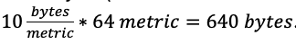

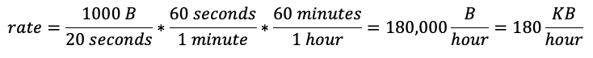

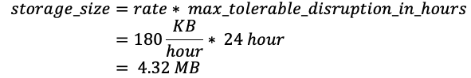

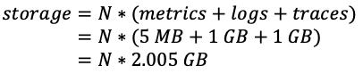

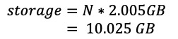

---

Merging Azure IoT Operations Configuration
### running inside of AIO. This presents a problem.
### A unified ama-metrics-prometheus-config  configuration will be created that merges the AIO configuration and additional configurations to scrape telemetry from <service-name>.
### <namespace>.svc.cluster.local:8889/metrics  per deployed OpenT elemetry Collector instance.
### Security
### It should be noted that opentelemetry-collector-contrib  image is hosted externally  and available via both Docker Hub and GitHub Container Registry .
| Azure Monitor Agent (AMA) will be configured to pull telemetry from OpenT elemetry Collector ’s Prometheus. Azure IoT | Operations also configures | AMA | to pull telemetry from Prometheus server |
| --- | --- | --- | --- |
Data Retention
### Metrics
### nature of this solution, we recommend to continue with the default retention policy for Metrics.
| By default, platform and custom metrics are stored for 93 days. Prometheus metrics are stored for 18 months, but a PromQL | query can only span a maximum of 32 days. ( source ) Based on the |
| --- | --- |
Logs and Traces
By default, Log Analytics workspaces have a data retention period of 30 days ( source ). This retention policy is configurable. Based on the nature of the solution and feedback from Kraft,
### retention period of 93 days will be configured for this solution.
### Alerting
Azure Monitor Alerts helps to detect and notify users when certain alerting rules are met. Alerting rules can be configured on data sources that include Azure Monitor Metrics, Log Analytics, and
### Prometheus.
### For this engagement, the following type of alerts will be implemented:
Metric alertsAzure Monitor,
Application InsightsMetrics, LogsMetrics can be platform metrics, custom metrics, logs from Azure
Monitor or Application Insights. Metric alerts can also apply
### multiple conditions and dynamic thresholds.
### Log search
alertsLog Analytics
WorkspaceLogs Query Log Analytics to evaluate resource logs at a predefined
### frequency.
### Prometheus
alertsAzure Monitor
Managed PrometheusMetrics Alert rules are based on the PromQL open-source query
language.Alert Type Data Sources Type Comments

### Images from this page

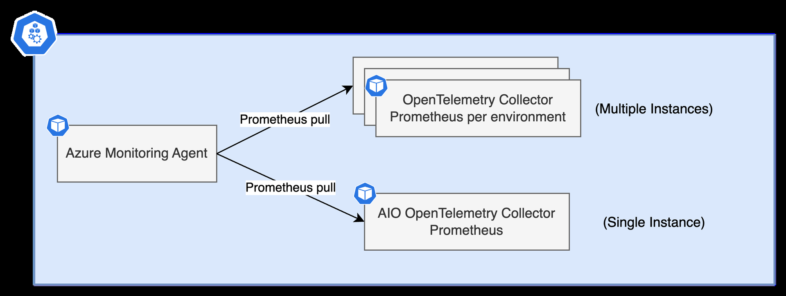

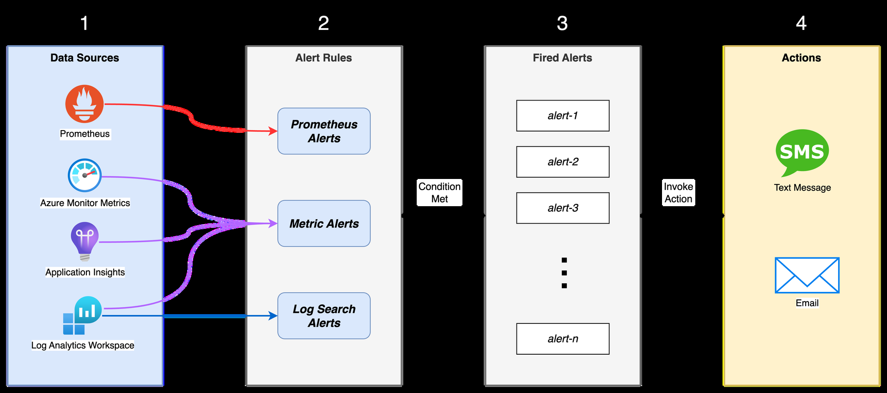

---

Alert Criteria
Alert Query
### Besides using the alert query to identify the alerts, the following scenarios must be covered.
- 1.. Application fatal issues
- 2.. SQL Server connectivity issues
- 3.. Blob Storage connectivity issue
- 4.. Unable to find tables in SQL  Server
- 5.. Partial or Incorrect SQL  results
Communication Mechanism
### Based on our discussions with Kraft, the following alerting mechanisms will be implemented:
Service Identification
### Each instrumented workload will be identified by its service.name . It will be a string composed of:
plant_id-environment-application_name
### Because multiple versions of an application may be deployed, each application will be further delineated by service.version .
### Both properties will be able to applications via environment variables:
OTEL_SER VICE_NAME
OTEL_RESOURCE_A TTRIBUTES="service.version=<VERSION>"
Instrumentation in Workloads
### Applications that implement OTLP  instrumentation must retrieve the following environment variables:
OTEL_SER VICE_NAME
OTEL_RESOURCE_A TTRIBUTES
OTEL_EXPORTER_OTLP_ENDPOINT
OTEL_EXPORTER_OTLP_TRACES_ENDPOINT
OTEL_EXPORTER_OTLP_METRICS_ENDPOINT
OTEL_EXPORTER_OTLP_LOGS_ENDPOINT
OTEL_EXPORTER_OTLP_INSECURE=true (secure without certificate validation)

Publishing using opentelemetry-shell looks like:
1 spec:
2  containers:
3  - name: {{ .Values.app.name }}
4    image: {{ .Values.image }}
5    env:
6      - name: OTEL_EXPORTER_OTLP_ENDPOINT
7      valueFrom:
8          configMapKeyRef:
9            name: platform-config
10           key: OTEL_EXPORTER_OTLP_ENDPOINT

The following changes will be implemented:
1. Platform configurations will be updated to expose these values per cluster .
2. Applications will be able to read these values using the following code:

## Control Tower
Control Tower currently uses a checkpoint system implemented in Azure Table Storage. This system records the timestamp of the last successful file upload, allowing the application to track and
determine the most recent upload event. By doing so, it ensures continuity and prevents redundant uploads.

### Publishing a custom metric
In lieu of querying Azure Table Storage, we propose publishing a custom metric finished_execution . This has two advantages:
1.  In the existing IoT Edge module-based solution, cloud synchronization is handled by IoT Edge. However, there may be inaccuracies since a checkpoint record is written to Azure Table
Storage before the synchronization occurs.
2. No need to provision read permissions between Blob Storage and Grafana.
This metric can be published by Control Tower application code or RClone sidecar  that is responsible for data synchronization.

### Application publishes metric (chosen path)
The code changes to application will look like:

1 from opentelemetry import metrics
2
3 meter = metrics .get_meter (__name__ )
4
5 counter = meter.create_counter (

6 name="last_successful_uploaded_timestamp" ,
7 unit="1", 
8 description ="The last successfully file uploaded timestamp" ,
9 )
10
11 counter.add( 1)

It is recommended to use a [counter](https://opentelemetry.io/docs/specs/otel/metrics/data-model/) : a value of 1 or more indicates a recorded checkpoint, while a value of 0 or the absence of a value indicates a failure.
If the application publishes the metric, there will still be inaccuracies between the checkpointed record and the synchronization of files to the cloud discussed previously . Due to this, this approach is NOT  recommended.

### RClone publishes metric (alternative path)

After a successful upload, rclone publishes an entry indicating it has successfully copied files to cloud. Currently , there is no of ficial OpenT elemetry SDK for shells like Bash or PowerShell. However , there are a few open-source implementations we can leverage:
- [opentelemetry-shell](https://github.com/krzko/opentelemetry-shell)  (recommended) – A wide array of functions for publishing metrics. Logs and traces are yet to be implemented or have a rudimentary implementation.
- [OTEL](https://github.com/serkan-ozal/otel-bash)  (OpenT elemetry) Bash  – Supports auto instrumentation.

1#!/usr/bin/env bash
2
3# Import functions
4 . opentelemetry-shell/library/otel_metrics.sh
5
6# Main
| 7otel_metrics_push_gauge "ko.wal.ski/brain/memory/used_bytes" | \ |
| --- | --- |
| 9 | "By" \ |
| 12 | $RANDOM \ |
| 13 | int |
---

## Service-level Indicators
.sql_connection_created 1 = true. 0 = false. Able to establish a connection to SQL.
total_files_created_count Count of files to be created
total_files_created_size_in_bytes The total size of files created in bytes
elapsed_time Time it took to run the entire job
num_sql_queries_with_data Number of SQL queries that returned data
finished_execution Publish 1 to indicate a successful run.Metric Description

## Dashboard
A Grafana dashboard will be created to provide fleet-wide visibility into Control Tower operations. This dashboard will mirror the functionality of an existing dashboard in Azure W orkbooks.
To aid in reducing number of tiles and enhance usability , additional filtering options will be introduced. These options will include filters for at least plant location and environment (e.g., dev , stage, prod).
A more detailed dashboard will be built that will enable correlation of logs and metrics per deployed instance.
## Capacity Requirements

### CPU & Memory
[Scaling](https://opentelemetry.io/docs/collector/scaling/) the OpenTelemetry Collector depends on the telemetry production rate, consumption rate, and queue size. Previously , we suggested a queue size of 3000 and a data production rate of 5 MB per day per workload being written to disk. This indicates that we may not require much memory . Therefore, we empirically propose the following which fits with our requested CPU and memory specifications documented in Resource Utilization & Capacity Estimates. 

Application Multiplicity Min CPU Min |
| --- | --- | --- |
MemoryMax CPU Max
MemoryComments

|
| --- | --- |
from the cloud.OpenTelemetry
Collectorn – Per
environment500m 1024Mi 2000m 2048Mi
Azure
Monitoring Agent 1 – Per cluster 405m 1100Mi 14100m 29700Mi Already captured in
capacity requests.
| Total | 905m 2124Mi 16100m 31748Mi | 

---
