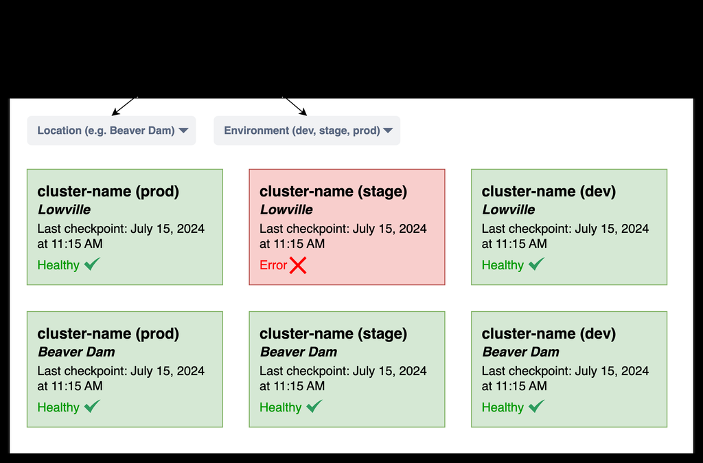
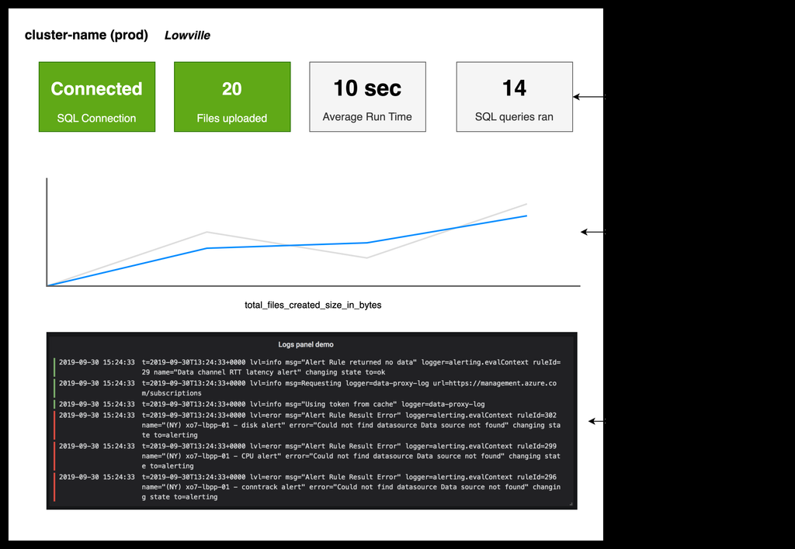

<!-- Generated by PDF to Markdown Converter v1.1.0 -->

# Application Observability for Edge-Deployed Solutions

## Overview

### Background
In modern distributed systems, observability is crucial for maintaining the health, performance, and reliability of edge-deployed solutions. This document outlines design choices for implementing observability at the edge, and addresses the following business objectives:

- **Proactive Issue Detection and Easier Root Cause Analysis**: The observability platform will enable the identification and resolution of potential issues before they impact users. By quickly pinpointing the root cause of problems, downtime can be minimized, ensuring that service level objectives (SLOs) and service level indicators (SLIs) are consistently met for edge-deployed solutions.

- **Informed Decision-Making**: By leveraging metrics, logs, and traces collected from edge devices, stakeholders can make data-driven decisions regarding system improvements and resource allocation.

- **Improved Operational Efficiency**: Centralize monitoring for all HCI clusters and applications in a single unified platform to enhance operational efficiency.

- **Integration of Deployment Components**: Seamlessly integrate deployment components such as GitOps and CI/CD with the central observability platform.

- **Compatibility with Key Technologies**: Ensure the proposed solution is compatible with Stack HCI, Kubernetes, GitOps-based fleet management, and aligned with Microsoft's observability tech stack strategy.

## Pillars of Observability
The purpose of an observability system is to collect, process, and export signals. These signals typically encompass three main components:

- **Metrics**: Quantitative data measuring system performance and health, such as CPU usage, memory consumption, request rates, and error rates.
- **Logs**: Detailed, timestamped records of events and actions within a system, providing insights into behavior and application state.
- **Traces**: End-to-end records of requests or transactions propagating through different services and components in a distributed system, identifying performance bottlenecks and dependencies.

## Edge Observability Design

### Data Sources
Options evaluated for sending telemetry back to the cloud:

1. **Azure Monitor Container Insights**:
   - First-party solution from Microsoft
   - Collects telemetry from edge containers systems
   - Delivers to Azure Monitor services depending on signal type

2. **OpenTelemetry Collector**:
   - Open-source, vendor-agnostic component
   - Collects, processes, and exports telemetry data

3. **Azure Monitor Edge Pipeline (Preview)**:
   - First-party solution for building data ingestion pipelines
   - Similar to OpenTelemetry Collector but not considered due to preview status

| Comparison | Container Insights | OpenTelemetry |
|------------|-------------------|---------------|
| Ease of Deployment | Easy, enabled as an extension | Medium, requires YAML configuration |
| Supported Environments | Azure-only | Multi-cloud, hybrid |
| Data Collection | Automatic for predefined resources | Flexible, manual or automatic instrumentation |
| Storage | Azure Monitor | Multiple backends (e.g., Application Insights, Prometheus) |

## Data Platform

### Visualization
Visualization platforms translate complex telemetry data into actionable insights:

- **Azure Managed Prometheus**: PromQL interface for Azure Monitor Metrics
- **Log Analytics**: Powerful analysis engine with KQL query language
- **Application Insights**: Correlation for developers
- **Grafana**: Multi-data source integration with popular plugins

## Proposed Development Plan

### Architecture
1. Deploy an OpenTelemetry Collector instance per environment (SDLC)
2. Configure Azure Monitor Agent (AMA) to pull telemetry from OpenTelemetry Collector's Prometheus
3. Deploy Kubernetes service for OTLP instrumented workloads to send telemetry

## OpenTelemetry Collector Pipeline

### Receivers
- **OTLP Receiver**: Receives data via gRPC or HTTP using OTLP format
- **Kubelet Stats Receiver**: Metrics for node, pod, container, and volume
- **Kubernetes Cluster Receiver**: Cluster-level metrics and events

### Processors
- **Batch Processor**: Compresses data, reduces outgoing connections

### Exporters
- **Azure Monitor Exporter**: Sends logs, traces, and metrics to Application Insights
- **Prometheus Exporter**: Exports data in Prometheus format for scraping by Prometheus server

## Estimating Storage Requirements

### Metrics
Example calculation for Kubelet Stats Receiver:
1 KB payload every 20 seconds. For 1 hour:
```
Payload size * Frequency * Duration = 1 KB * (3600/20) = 180 KB/hour
```

**Daily Storage**: Round up to 5 MB/workload/day

### Logs & Traces
Estimated at 1 GB/day

## Deployment and Deployment Artifacts
OpenTelemetry Collector deployed using GitOps-based workflow. PersistentVolumeClaim (PVC) will ensure local disk caching.

## Merging Azure IoT Operations Configuration
Unified configuration combining AIO telemetry and AMA Prometheus scraping.

## Alerting

### Types of Alerts
- Metric alerts: Azure Monitor Metrics, Application Insights
- Log search alerts: Log Analytics Workspace
- Prometheus alerts: PromQL rules

### Alert Criteria
- Fatal issues
- SQL Server connectivity issues
- Blob Storage connectivity issues

## Instrumentation in Workloads
Applications implementing OTLP instrumentation must retrieve values via environment variables:
- `OTEL_SERVICE_NAME`
- `OTEL_RESOURCE_ATTRIBUTES`

## Control Tower
Control Tower checkpoints implemented in Azure Table Storage will be replaced with a custom metric `finished_execution`.

## Service-Level Indicators

### Dashboard
A Grafana dashboard will provide fleet-wide visibility into Control Tower operations. Filtering options for location and environment will be introduced.

## Capacity Requirements

### CPU & Memory
Empirical suggestions based on telemetry production rate and queue size.

### Disk Space
Each OpenTelemetry instance requires 10 GB of disk space for one day of telemetry storage during network disconnection.

| Component | Min CPU | Min Memory | Max CPU | Max Memory | Comments |
|-----------|---------|------------|---------|------------|----------|
| OpenTelemetry Collector (per environment) | 500m | 1024Mi | 2000m | 2048Mi | |
| Azure Monitoring Agent (per cluster) | 405m | 1100Mi | 14100m | 29700Mi | Already captured in capacity requests |
| Total | 905m | 2124Mi | 16100m | 31748Mi | |

## Images
The document references the following image files for visual representation:




---

**Credits**: [Azure Monitor Overview](https://learn.microsoft.com/en-us/azure/azure-monitor/overview)
