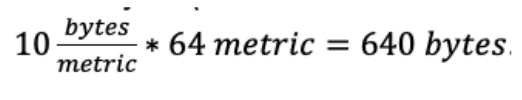
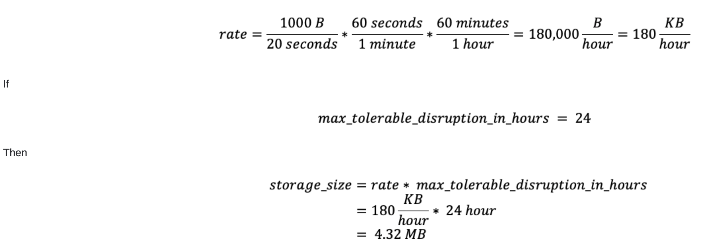

# Application Observability for Edge-Deployed Solutions

## Overview
In modern distributed systems, observability is crucial for maintaining the health, performance, and reliability of edge-deployed solutions. This document outlines design choices for implementing
observability at the edge, and addresses the following business objectives:
- **Proactive Issue Detection and Easier Root Cause Analysis**: The observability platform will enable the identification and resolution of potential issues before they impact users. By quickly
pinpointing the root cause of problems, downtime can be minimized, ensuring that service level objectives (SLOs) and service level indicators (SLIs) are consistently met for edge-deployed
solutions.
- **Informed Decision-Making**: By leveraging metrics, logs, and traces collected from edge devices, stakeholders can make data-driven decisions regarding system improvements and
resource allocation.
- **Improved Operational Efficiency**: Centralize monitoring for all HCI clusters and applications in a single unified platform to enhance operational efficiency.
- **Integration of Deployment Components**: Seamlessly integrate deployment components such as GitOps and CI/CD with the central observability platform.
- **Compatibility with Key Technologies**: Ensure the proposed solution is compatible with Stack HCI, Kubernetes, GitOps-based fleet management, and aligned with Microsoft's observability
tech stack strategy.
- **Optimal Data Flow from Edge to Cloud**: As edge might be bandwidth constrained, optimize the flow of the telemetry from edge to observability platform.
- **Offline Capabilities**: The observability platform should be resilient to network outages. It must have the capability to automatically resume data collection and transmission once network
connectivity is restored, ensuring no critical data is lost during downtime.
### Background

### Pillars of Observability

The purpose of an observability system is to collect, process, and export signals. These signals typically encompass three main components:

- **Metrics**: Quantitative data that measures various aspects of a system's performance and health, such as CPU usage, memory consumption, request rates, and error rates.
- **Logs**: Detailed, timestamped records of events and actions that occur within a system, providing context and insights into the behavior and state of applications and infrastructure.
- **Traces**: End-to-end records of requests or transactions as they propagate through different services and components in a distributed system, helping to identify performance bottlenecks and dependencies.

For more information on these pillars and differences between metrics, traces, and logs, please refer to [Observability - Engineering Fundamentals Playbook](https://microsoft.github.io/code-with-engineering-playbook/observability/).

---

## Edge Observability Design

In an edge system, the ability to send telemetry to the cloud for analysis requires 1. instrumented systems and 2. an agent that facilitates gathering and transmitting telemetry data to the cloud.

[Azure Monitor](https://learn.microsoft.com/en-us/azure/azure-monitor/overview) is the umbrella term for a range of products that provide instrumentation, transportation, storage, alerting, and analysis capabilities.

---

## Data Sources

For sending telemetry back to cloud, the following options were evaluated:
1. [Azure Monitor Container Insights](https://learn.microsoft.com/en-us/azure/azure-arc/kubernetes/extensions-release#azure-monitor-container-insights) – A first-party solution from Microsoft that collects telemetry from edge containers systems and delivers to portfolio of services inside Azure Monitor
depending on the type of signal.
2. [OpenTelemetry Collector](https://opentelemetry.io/docs/collector/) – A vendor-agnostic open-source component designed to collect, process, and export telemetry data.
3. [Azure Monitor Edge Pipeline (preview)](https://learn.microsoft.com/en-us/azure/azure-monitor/essentials/edge-pipeline-configure?tabs=Portal) – A first-party solution from Microsoft for building data ingestion pipelines. Very similar to OpenTelemetry Collector. This product is NOT considered
due to its preview status.

| **Data Source**                       | **Ease of Deployment**                                           | **Supported Environments**      | **Data Collection**                          | **Storage**                  |
|---------------------------------------|------------------------------------------------------------------|----------------------------------|-----------------------------------------------|------------------------------|
| Azure Monitor Container Insights      | Easy. Enabled as an extension.                                  | Supported in Azure only          | Automatically of predefined resources. [Collection rules can be
configured as needed.] (Collection rules can be
configured as needed.)      | Azure Monitor                |
| OpenTelemetry Collector               | Medium. Deployed using GitOps-based workflow. Requires YAML     | Multi-cloud, on-premise, hybrid. | More flexibility. Manual or automatic instrumentation. [Vast array of open-source collectors available.](Vast array of open-
source collectors available.) | Multiple backends including Application Insights, New Relic, ElasticSearch, Prometheus, etc. |
| Azure Monitor Edge Pipeline (preview) | Not considered due to its preview status.                       | -                                | -                                             | -                            |

---

## Recommendation

### Assessment Criteria

1. It's crucial to account for periodic network interruption between edge systems and the cloud.
2. Bandwidth limitations: our solution should judiciously transmit telemetry to the cloud.
3. The system should offer workload visibility with minimal configuration.
4. The observability system should have the capability to enrich the telemetry for improved consolidation in Log Analytics and Grafana.

### Result

Based on the criteria, **OpenTelemetry** is recommended as the preferred technology.
OpenTelemetry provides the capability to queue messages in memory or on a file system to handle network interruptions between the edge and Azure, ensuring reliable telemetry transport.
Furthermore, OpenTelemetry offers flexibility in filtering metrics, logs, and traces, optimizing data transmission by selectively sending specific telemetry types and thereby reducing outbound
network traffic from the edge.
Lastly, it should be noted that Microsoft recommends using the OpenTelemetry Collector as a data processing pipeline and is committed to using OpenTelemetery going forwards. You can learn
more about this partnership here: [Application Insights OpenTelemetry data collection - Azure Monitor](https://learn.microsoft.com/en-us/azure/azure-monitor/app/opentelemetry-overview?tabs=aspnetcore#opentelemetry)
---

## Data Platform

A data platform is used for aggregating, analyzing, and visualizing telemetry data to gain insights into system performance, health, and operational efficiency.

| **Description**         | **Metrics** | **Logs** | **Traces** |
|--------------------------|-------------|----------|------------|
| Existing dashboards      | Yes         | Yes      | Yes        |
| Sharing dashboards       | Yes         | No       | Yes        |
| Existing dashboards and data source integration | Out-of-the-box and public GitHub templates and reports. Limited to Azure Monitor. | Limited to Azure Monitor. | Can connect to various data sources including relational and timeseries databases. Grafana has popular plugins and dashboard templates for application performance monitoring (APM). |

---

## Visualization

### Overview of Visualization Platforms

| **Platform**             | **Description**                                           | **Metrics** | **Logs** | **Traces** |
|--------------------------|-----------------------------------------------------------|-------------|----------|------------|
| Azure Monitor Metrics    | Time-series database optimized for analyzing time-stamped data. | Yes         | -        | -          |
| Azure Managed Prometheus | A PromQL interface on top of Azure Monitor Metrics.       | Yes         | -        | -          |
| Log Analytics            | Provides a powerful analysis engine and rich query language KQL. | Yes         | Yes      | -          |
| Application Insights     | Helps developers with correlation.                        | Yes         | Yes      | Yes        |

A detailed comparison can be found here: [Azure Monitor best practices - Analysis and visualizations - Azure Monitor](https://learn.microsoft.com/en-us/azure/azure-monitor/best-practices-analysis)
---

## Proposed Development Plan

### Architecture

1. An OpenTelemetry Collector instance will be deployed per environment supporting software development lifecycle (SDLC). This enables the development, testing, and deployment in a
controlled and systematic manner.
2. Azure Monitor Agent (AMA) will be configured to pull telemetry from OpenTelemetry Collector’s Prometheus. AMA is used as an agent in the middle to push telemetry to Azure Managed
Prometheus. Presently AMA supports only Azure RBAC for authorization. AMA helps to connect OpenTelemetry with Prometheus with the help of Service Principal.
a. This necessitates coordination between AIO telemetry collection pipeline as AIO also configures AMA agent to pull telemetry.
3. A Kubernetes service will be deployed to enable OTLP instrumented workloads to send telemetry to service at <service-name>.<namespace>.svc.cluster.local:4317
4. Control Tower will publish a custom metric showing the most recent successful telemetry push to Blob storage. This means that no additional configuration will be needed to connect Azure
Managed Grafana to Azure Table Storage.
---

## OpenTelemetry Collector Pipeline

Credits: https://opentelemetry.io/docs/collector/

### Pipeline: Receivers

| **Receiver**                | **Description**                                           |
|-----------------------------|-----------------------------------------------------------|
| [OTLP Receiver](https://github.com/open-telemetry/opentelemetry-collector/blob/main/receiver/otlpreceiver/README.md)               | Receives data via gRPC or HTTP using OTLP format.         |
| [Kubelet Stats Receiver](https://github.com/open-telemetry/opentelemetry-collector-contrib/tree/main/receiver/kubeletstatsreceiver)      | Node, pod, container, and volume metrics.                |
| [Kubernetes Cluster Receiver](https://github.com/open-telemetry/opentelemetry-collector-contrib/tree/main/receiver/k8sclusterreceiver) | Collects cluster-level metrics and entity events.        |
| [RabbitMQ Receiver](https://github.com/open-telemetry/opentelemetry-collector-contrib/tree/main/receiver/rabbitmqreceiver)           | Receive telemetry information from edge gateway’s RabbitMQ component.
---

### Pipeline: Processors

| **Processor**    | **Description**                                   |
|------------------|---------------------------------------------------|
| [Batch Processor](https://github.com/open-telemetry/opentelemetry-collector/blob/main/processor/batchprocessor/README.md)  | Batching helps better compress the data.          |

---

### Pipeline: Exporters

| **Exporter**          | **Description**                                |
|-----------------------|------------------------------------------------|
| [Azure Monitor Exporter](https://github.com/open-telemetry/opentelemetry-collector-contrib/tree/main/exporter/azuremonitorexporter) | Sends logs, traces, and metrics to Application Insights. |
| [Prometheus Exporter](https://github.com/open-telemetry/opentelemetry-collector-contrib/tree/main/exporter/prometheusexporter)    | Exports data in Prometheus format.            |

---

## Helpers

| **Helper**          | **Description**                                |
|---------------------|------------------------------------------------|
| [Exporter Helper](https://github.com/open-telemetry/opentelemetry-collector/blob/main/exporter/exporterhelper/README.md)     | Retry capabilities with ability to persist metrics and logs to disk. |

---

## Extensions

| **Extension**         | **Description**                                |
|-----------------------|------------------------------------------------|
| [File Storage](https://github.com/open-telemetry/opentelemetry-collector-contrib/tree/main/extension/storage/filestorage)          | Persist state to the local file system.        |

---
## Estimating Storage Requirements
As noted earlier, Exporter Helper will be deployed to queue messages to disk in case of failures. Configurations must consider both short-term network disruptions and long-term outages. The
following calculations walkthrough estimating queue size and figuring out appropriate values for timeouts and backoff.

### Estimating storage
Metrics
One of the chattiest receivers we deploy is the Kubelet Stats Receiver, which broadcasts a payload every 20 seconds. The payload size is proportional to the number of workloads and currently
includes 64 metrics in numeric (integers and floats) and string formats. If we estimate that each field on average takes 10 bytes (about 10 characters in utf-8, 4 bytes for float, 8 bytes long, etc.),
then we have  We can round it up to 1 KB for simplicity.

Then for 1 hour, data transmitted is

We round up to a whole number meaning we need to store 5 MB of data/day/workload.

**Logs & Traces**
Logs and traces are a function of the rate and size of log statements. Let’s estimate this to be 1 GB/day.

Configuration
Based on rate of production, storage requirements, and maximum tolerable data loss, we propose the following configurations:
- Max outage = 1 day
- PVC storage minimum = 10 GB/day
- retry_on_failure
-- initial_interval=30
-- max_interval=60
-- max_elapsed_time=86400 (1 day)
- sending_queue
-- num_consumers=10
-- queue_size=3000 (Calculated as 86400/30=2880 rounded up to thousands)

### Deployment and Deployment Artifacts
The open-source [contributor](https://github.com/open-telemetry/opentelemetry-collector-contrib) version of OpenTelemetry Collector will be deployed using GitOps-based workflow. The contributor version is deployed because it includes the exporters (Azure
Monitor) and helpers (File Storage) required for our solution.
Furthermore, while the OpenTelemetry Collector does come with an official [Helm Chart](https://opentelemetry.io/docs/kubernetes/helm/collector/), it may not meet some of requirements when it comes to configuration. This may necessitate an extension
to existing chart or writing a custom deployment manifest. Deployments must ensure:
1. [PersistentVolumeClaim](https://kubernetes.io/docs/concepts/storage/persistent-volumes/) is attached to each deployed instance for caching to local disk.
2. [Service](https://kubernetes.io/docs/concepts/services-networking/service/) per deployed instance of Collector to ensure reachability via HTTP/gRPC.

### Merging Azure IoT Operations Configuration

Azure Monitor Agent (AMA) will be configured to pull telemetry from OpenTelemetry Collector’s Prometheus. Azure IoT Operations also configures AMA to pull telemetry from Prometheus server
running inside of AIO. This presents a problem.
A unified ama-metrics-prometheus-config configuration will be created that merges the AIO configuration and additional configurations to scrape telemetry from <service-name>.
<namespace>.svc.cluster.local:8889/metrics per deployed OpenTelemetry Collector instance.

### Security
It should be noted that opentelemetry-collector-contrib image is hosted externally and available via both Docker Hub and GitHub Container Registry.

## Data Retention
### Metrics
By default, platform and custom metrics are stored for 93 days. Prometheus metrics are stored for 18 months, but a PromQL query can only span a maximum of 32 days. ([source](https://learn.microsoft.com/en-us/azure/azure-monitor/logs/data-retention-archive?tabs=portal-3%2Cportal-1%2Cportal-2)) Based on the
nature of this solution, we recommend to continue with the default retention policy for Metrics.
### Logs and Traces
By default, Log Analytics workspaces have a data retention period of 30 days (source). This retention policy is configurable. 

## Alerting
Azure Monitor Alerts helps to detect and notify users when certain alerting rules are met. Alerting rules can be configured on data sources that include Azure Monitor Metrics, Log Analytics and Prometheus.

## Alert Criteria

Besides using the alert query to identify the alerts, the following scenarios must be covered.
1. Application fatal issues
2. SQL Server connectivity issues
3. Blob Storage connectivity issue
4. Unable to find tables in SQL Server
5. Partial or Incorrect SQL results

## Service Identification
### Each instrumented workload will be identified by its service.name . It will be a string composed of:
plant_id-environment-application_name
Because multiple versions of an application may be deployed, each application will be further delineated by [service.version](https://opentelemetry.io/docs/specs/semconv/resource/#service) .
Both properties will be able to applications via environment variables:
- OTEL_SER VICE_NAME
- OTEL_RESOURCE_A TTRIBUTES="service.version=<VERSION>"

## Instrumentation in Workloads
Applications that implement OTLP instrumentation must retrieve the following environment variables:
- OTEL_SER VICE_NAME
- OTEL_RESOURCE_A TTRIBUTES
- OTEL_EXPORTER_OTLP_ENDPOINT
- OTEL_EXPORTER_OTLP_TRACES_ENDPOINT
- OTEL_EXPORTER_OTLP_METRICS_ENDPOINT
- OTEL_EXPORTER_OTLP_LOGS_ENDPOINT

