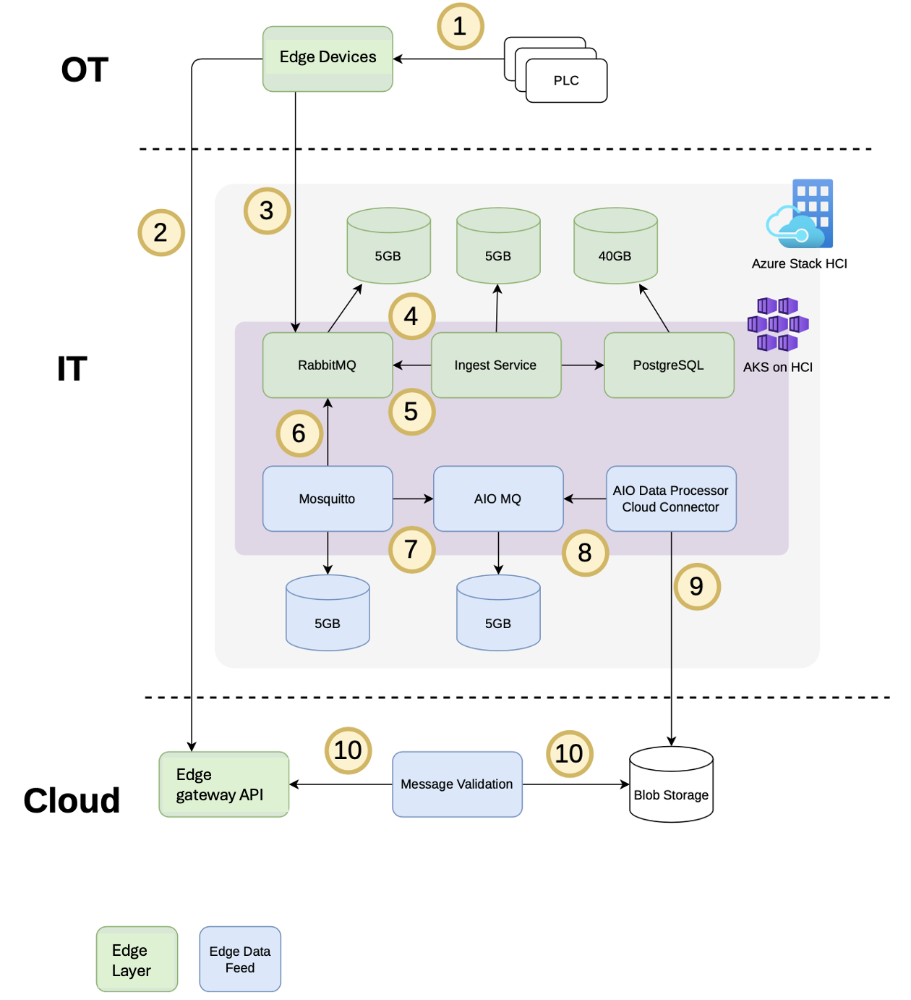
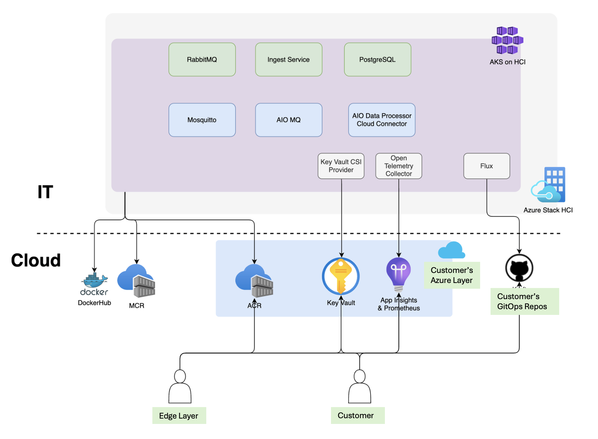

# Edge Gateway Data Feed in Kubernetes on the Edge

## Architecture Diagram

 
*ST-One and AIO components will be in their own namespaces.*

> [!NOTE] 
> We can query data from [PostgreSQL](https://www.postgresql.org/) directly for detailed validation & comparison. May require a different set of networking & connectivity challenges, but could be a fallback if AIO pipelines don’t work.
> This would decouple proving 2 things:  
> 1. Gateway data flow at the edge  
> 2. AIO data pipelines & cloud connectors  

## Edge Gateway Data Feed Process

1. PLCs and factory equipment send data to the edge devices inside the OT network.  
2. Edge Gateway batches and sends data up to the Cloud where it is made available through an API.  
3. Edge devices batch and send data to the Gateway [RabbitMQ](https://www.rabbitmq.com/) broker in the IT network.  
4. The Edge Ingest Service processes the batch messages from the Edge devices.  
5. The Gateway Ingest Service places individual telemetry messages back into RabbitMQ.  
   - The Ingest service is a black-box that hosts proprietary Edge Gateway algorithms for handling batching and compression. PostgreSQL is used to store time-series data needed for the Ingest Service.  
6. The [Mosquitto](https://mosquitto.org/) broker bridges topics from RabbitMQ. These are individual telemetry messages.  
   - Mosquitto is required to bridge topics due to incompatibilities between RabbitMQ’s MQTT plugin and AIO’s MQ bridging.  
7. The Mosquitto broker bridges topics into AIO MQ to be made available for AIO components.  
8. AIO Data Processing pipelines or Cloud Connectors read messages from the AIO MQ.  
   - The AIO MQ service may be redundant if AIO features can read messages directly from Mosquitto.  
9. AIO Data Processing pipelines or Cloud Connectors write telemetry to [Azure Blob Storage](https://learn.microsoft.com/en-us/azure/storage/blobs/).  
10. The Message Validation component reads individual messages from Azure Blob Storage and the Gateway API to compare and validate Edge Device messages flowing through the [Azure Stack HCI AKS cluster](https://learn.microsoft.com/en-us/azure/azure-stack/hci/).  

## Gateway Kubernetes Components

The components that make up the Gateway portion in Kubernetes include:

1. **[RabbitMQ](https://learn.microsoft.com/en-us/azure/architecture/example-scenario/messaging/rabbitmq-overview)**: A message broker that supports MQTT through a plugin.  
   - Requires a 5GB mounted volume for storing queued messages.  
   - Deployed as a single pod Kubernetes StatefulSet and configured with ConfigMaps and Secrets.  
   - See [Deploying RabbitMQ to Kubernetes](https://www.rabbitmq.com/blog/2020/08/10/deploying-rabbitmq-to-kubernetes-whats-involved) for more details on deploying in Kubernetes.

2. **The Ingest Service**: A proprietary service that manages messages from the OT network through RabbitMQ and includes custom batch decompression logic for placing individual telemetry messages back into RabbitMQ.  
   - Requires 5GB mounted volume to use for caching.  
   - Deployed as a Kubernetes Deployment and configured with ConfigMaps and Secrets.

3. **[PostgreSQL](https://learn.microsoft.com/en-us/azure/postgresql/)**: Implemented as [TimescaleDB](https://www.timescale.com/) to store time-series data. This provides backing storage for the Ingest service.  
   - Requires 40GB mounted volume for longer-term persistence.  
   - Deployed as a single pod Kubernetes StatefulSet and configured with ConfigMaps and Secrets.  
   - Timescale used to support a Helm chart, but recently deprecated it in favor of [PostgreSQL operators for Kubernetes](https://learn.microsoft.com/en-us/azure/azure-arc/data/azure-arc-enabled-postgresql-hyperscale).  

## AIO Kubernetes Components

The components that make up the AIO portion in Kubernetes include:

1. **Mosquitto**: Not specific to AIO, but required to bridge messages with Gateway’s RabbitMQ.  
   - Requires a 5GB mounted volume for storing queued messages.  
   - Deployed as a StatefulSet and configured with ConfigMaps and Secrets.  
   - See [Mosquitto Bridge Configuration](https://mosquitto.org/man/mosquitto-8.html) for more details on setting up a Mosquitto broker as a bridge in Kubernetes.

2. **[AIO MQ](https://learn.microsoft.com/en-us/azure/iot-hub/iot-hub-mqtt-support)**: AIO’s MQTT message broker. This component may be redundant with the Mosquitto broker depending on whether AIO features can integrate well with Mosquitto.  
   - This is installed as part of AIO itself. There is no need to deploy additional pods.  
   - AIO MQ can be configured to use persistent storage for storing queued messages; we will configure 5GB for this purpose.

3. **AIO Data Processor & Cloud Connector**: AIO’s features that can transport data from message brokers to the cloud (Azure Blob Storage).  
   - We would only need one of these options to send data from an MQTT broker to Azure Blob Storage.  
   - [AIO Data Processor](https://learn.microsoft.com/en-us/azure/iot-operations/connect-to-cloud/overview-dataflow) runs generic no-code pipelines for processing data at the edge. We would not directly deploy the pods that these pipelines run on.  
   - [Cloud Connectors](https://learn.microsoft.com/en-us/azure/iot-operations/connect-to-cloud/howto-create-dataflow?tabs=portal#configure-to-send-data-to-azure-data-lake-storage-gen2-using-sas-token) are no-code components that define connections that bridge data between a source and destination. We would not directly deploy the pods that these connectors run on.

## Container Images

The table below shows all of the container images that are required to power the system above. Platform-level components can pull from  
mcr.microsoft.com  for images while custom components and open source images will be hosted in customer’s ACR to enable security  
scanning, but we can pull from Dockerhub for the POC.   

| Kubernetes Component                       | Maintainer           | Image                         | Public/Private | Container Registry                                 |
|-------------------------------------------|----------------------|--------------------------------|----------------|----------------------------------------------------|
| RabbitMQ                                  | Docker Community     | rabbitmq                      | Public         | khazeus2controltowecacr001.azur ecr.io          |
| Ingest Service                            | ST-One              | ---                           | Private        | khazeus2controltowecacr001.azur ecr.io          |
| PostgreSQL                                | Timescale           | timescale/[timescaledb-ha](https://hub.docker.com/r/timescale/timescaledb-ha)      | Public         | khazeus2controltowecacr001.azur ecr.io          |
| Mosquitto                                 | Eclipse Foundation  | [eclipse-mosquitto](https://hub.docker.com/_/eclipse-mosquitto)             | Public         | khazeus2controltowecacr001.azur ecr.io          |
| AIO MQ                                    | Microsoft           | ---                           | Public         | mcr.microsoft.com                                  |
| AIO Data Processor & Cloud Connector      | Microsoft           | ---                           | Public         | mcr.microsoft.com                                  |

## Gateway Operations and Monitoring

All components in the system will be operated and monitored using Kraft’s infrastructure.  
This means Gateway and AIO components will be monitored and managed using the same services. This includes deployment through GitOps and Fleet Management as well as using a common observability stack.

Gateway will aid in managing Gateway services by being onboarded to Kraft’s domain and gaining [Azure RBAC](https://learn.microsoft.com/en-us/azure/role-based-access-control/overview) and other required roles for managing the system. These roles include:

1. A-ID accounts and Azure RBAC Contributor roles to the Dev Resource group in Azure.  
2. ZScaler set up for network connectivity to Kraft environments.  
3. [ACR tokens scoped to only Gateway image repositories](https://learn.microsoft.com/en-us/azure/container-registry/container-registry-repository-scoped-permissions).  
