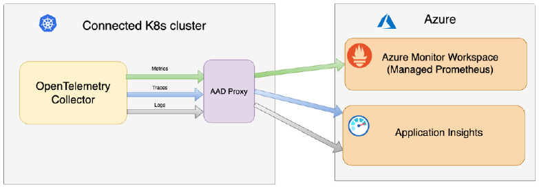
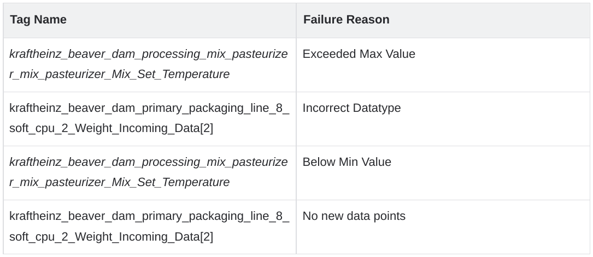

# Spike: Design Data Quality Solution

## Description

As a Data Engineering and Data Science team, we need an acceptable way to:

- Track data quality
- Determine if the data thresholds are strict or is a general guideline
- Graphs to visualize data quality trends
- Provide alerts on bad data to ensure ML predictions are accurate

## Acceptance Criteria

- **Data Quality requirements** are captured and solution design is documented in an ADR and approved by Data Science and Data Engineering teams
- Identify clear metrics to be measured, ranges?, frequency? and criteria for alerting
- **New stories** are added to DTGA-88: WS2: Data Quality IN PROGRESS to implement the solution

## Findings

### What can we gather from the data in the present state?

**Snapshot of data format:**
`WS1_ML_RawData_AllTags_Catalog_20240605.xlsx`

Currently, there are three main columns we are referencing to determine if the data obtained is accurate:

- `min` - minimum accepted value for that tag
- `max` - maximum accepted value for that tag
- `max_age_secs` - maximum allowed time that has passed since last data received

### How do we determine the metrics to track?

#### Metric #1: Value Range

We can determine data quality by evaluating datapoints based on the `min` and `max` column values.

**Example:**
If we receive a data value of **250 F** for the tag:
`factory_processing_mix_pasteurizer_mix_pasteurizer_Mix_Set_Temperature`,
then we can evaluate that data point as **faulty data** since the `min` value is **32 F** and `max` value is **212.2 F**, and this datapoint falls outside that range.

#### Metric #2: Missing Data

We can keep track of the `max_age_secs` column and determine if we have received an updated value from the data source for that particular tag. This value needs to fall within the `max_age_secs` threshold, otherwise, we can create a metric to track tags that are missing data beyond the `max_age_secs` value.

**Example:**
If we do not receive a value for tag:
`factory_primary_packaging_line_8_soft_cpu_2_Weight_Incoming_Data[2]`
in **345600 secs** (`max_age_secs` threshold), we can create a metric to track this scenario taking place for this tag.

#### Metric #3: Data Type Validation

This metric can be used to validate if the data value received from the data source is of the correct datatype.

**Example:**
If the data received for tag:
`factory_cpu_1_and_safety_HMI.Bit.Dosing1_H`
is `True` or `False` (Boolean or string) instead of **0** or **1** (integer), we can create a metric to track if the data received is in the correct format.

### How do we analyze/visualize the metrics we have gathered?

#### Tables

We have the following data: `tag name`, `failure count`, and `failure reason`. From this, we can create one list of tuples with the following schema:

```python
[(tag_name, failure_reason)]
```

From this, we can create tables that help us visualize the errors and even sort and manipulate the data to match our needs.

**Example Table:**

| Tag Name | Failure Reason |
|----------|---------------|
| factory_processing_mix_pasteurizer_Mix_Set_Temperature | Exceeded Max Value |
| factory_primary_packaging_line_8_soft_cpu_2_Weight_Incoming_Data[2] | Incorrect Datatype |
| factory_processing_mix_pasteurizer_Mix_Set_Temperature | Below Min Value |
| factory_primary_packaging_line_8_soft_cpu_2_Weight_Incoming_Data[2] | No new data points |

#### Graphs

There are roughly **1170 tags** (as per the excel file above). Due to this large amount, we cannot have graphs for each and every tag individually.

We can visualize cases when there are failure instances in any of the three metrics (`min-max`, `time`, `datatype`).

**Optional Graph:**
We can also add a dynamic chart that will update with the tags that contain the highest error counts.

### Brief Notes

#### Alarming

We can additionally configure an alarming system to trigger an alarm on specific thresholds we select. The alarming method can vary depending on user needs, such as:

- Email
- Pager
- MS Teams channel alert, etc.

**Example Alarm Scenario:**
"Send an email to all WS2 engineers when the **Exceeded Max Value** error type for all tags is greater than 10."

#### Invalid Data

The current agreed approach on **invalid data** would be to:

- Not modify the incoming data (no removal of bad data)
- Pass the JSON object of results (showing which datapoints are invalid) to the inference function as a parameter

This will decouple the validation check and the action to take since there may be instances where some bad data is acceptable to continue running inference.

**Note:** The validation check would also be conducted prior to pivoting the data.

## Which tools should we use for data quality checks?

### Great Expectations

- Great Expectations is an open-source Python library designed for data quality checks, validation, and documentation
- Can be used to create assertions on the data to ensure the data is in the expected format

#### Links

- [Home | Great Expectations](https://great-expectations.io)
- **POC for Great Expectations:** great-expectations-sample

### Grafana (Future)

Grafana is an open-source analytics and monitoring platform designed to:

- Query
- Visualize
- Alert
- Explore metrics, logs, and traces

A Grafana dashboard would be a great tool to monitor the failure rates in a single place.
Since this setup will need adjustments on alarming values after the data is validated, **we will not be prioritizing this for the next few sprints.**

#### Links

- [Grafana | Query, visualize, alerting observability platform](https://grafana.com)

## Resources

- [How to ensure data quality with Great Expectations | by Tomáš Sobotík](https://medium.com/snowflake-builders-blog/data-quality-great-expectations)
- [great-expectations/great_expectations (GitHub)](https://github.com/great-expectations/great_expectations)
- [Get started with Great Expectations and Databricks](https://great-expectations.io/databricks-start-guide)

## Images







