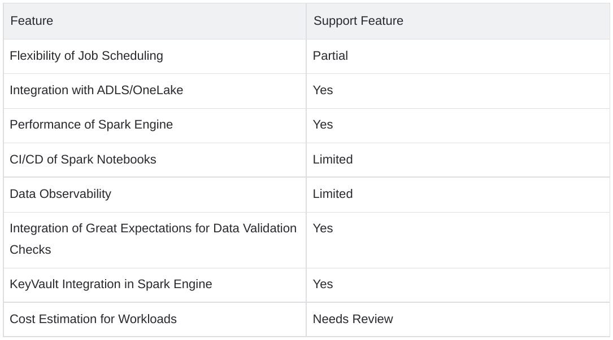
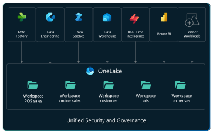

# Spike: Evaluate [Spark Engine in Azure Fabric][spark-compute]

## Description

As a data engineer, I want to run transformation jobs in [Spark Engine in Fabric][spark-jobs] to evaluate the following:

- Integrate with MVE Data Generator
- [Flexibility of Job Scheduling][job-scheduling]
- [Integration with ADLS/OneLake][onelake]
- [Performance of Spark Engine][runtime-deep-dive]
- [CI/CD of Spark Notebooks][git-integration]
- [Data Observability][monitor-spark]
- [Integration of Great Expectations][data-quality]
- [KeyVault Integration][key-vault]
- [Cost Estimation][capacity-planning]

## Summary

### Findings

#### Flexibility of Job Scheduling

In short, Apache Spark job scheduling can be done at the Cluster level or at the Spark Application level:

- **Cluster Level:**
  Here, a job refers to multiple Spark applications. This refers to scheduling jobs on the same cluster
  based on the resources available in the cluster. Each job requests resources from the cluster manager
  for processing the job. Once the request is approved, these resources are locked and won't be
  available for subsequent jobs until they are released.

- **Application Level:**
  In Spark, an action triggers a job. There might be cases where multiple job requests come in;
  job scheduling refers to scheduling these jobs accordingly.

#### Spark Job Definition Comparison

| Feature | Support Status |
|---------|---------------|
| Concurrency Throttling and Queueing | Flexibility of Job Scheduling Partial |
| Integration with ADLS/OneLake | Yes |
| Performance of Spark Engine | Yes |
| CI/CD of Spark Notebooks | Limited |
| Data Observability | Limited |
| Integration of Great Expectations for Data Validation Checks | Yes |
| KeyVault Integration in Spark Engine | Yes |
| Cost Estimation for Workloads | Needs Review |

### Key Details

#### [Microsoft Fabric Spark Job Submission][submit-spark-jobs]

- Job submission is based on purchased [Fabric capacity SKUs][fabric-skus]
- The queueing mechanism operates as a **FIFO-based queue**, allowing jobs to be submitted once capacity becomes available
- When the capacity is fully utilized due to concurrent running jobs, new submissions are throttled with the message:

> "Unable to submit this request because all the available capacity is currently being used.
> Cancel a currently running job, increase your available capacity, or try again later."

[Notebook jobs][notebook-execution] and [Spark job definitions][job-definition] are automatically
retried when capacity becomes available. The queue expiration is set to **24 hours** from the job
submission time.

#### [Bursting][capacity-bursting]

- Fabric capacities support **bursting**, enabling extra compute cores beyond what you've purchased
- For Spark workloads, bursting allows users to submit jobs with a total of **3X the Spark VCores purchased**
- Bursting increases the total number of Spark VCores for concurrency but doesn't increase the maximum cores per job
- Users cannot submit a job that requires more cores than what their Fabric capacity offers

#### Optimistic Job Admission

- Introduced for more **flexibility in concurrency usage**
- Users can run up to ~24 jobs concurrently with the same configuration when submitted concurrently
- Prevents job starvation and significantly improves concurrency (up to ~12X in some cases)

### [Custom Apache Spark Pools][spark-pools]

- **Custom Spark Pools** can be created in Fabric
- Enable or disable [**autoscaling**][autoscale] for custom Spark pools
- With autoscaling, the pool dynamically acquires nodes up to a maximum limit specified by the user,
  retiring them after job execution. This dynamic resource adjustment ensures better performance based
  on job requirements.

### Additional Considerations and Limitations

- **Livy API:** In the roadmap but not yet exposed in Fabric. Users must create notebooks and Spark
  job definitions with the Fabric UI
- **Managed Identity:** Currently, Fabric doesn't support running notebooks and Spark job definitions
  using workspace identity or managed identity for Azure KeyVault within notebooks

## Performance of Spark Engine

- Spark engine in Fabric spins up significantly faster than Synapse Engine: **2 to 4 seconds vs ~2 minutes**

## [Integration with ADLS/OneLake][onelake]

### [OneLake: To Rule Them All][onelake-overview]

#### Overview

[OneLake][onelake] is a single, unified, logical data lake for the entire organization, akin to OneDrive.
OneLake comes automatically with every Microsoft Fabric tenant and is designed to be the **single place
for all analytics data**. OneLake offers:

- One data lake for the entire organization
- One copy of data for use with multiple analytical engines

#### Key Features of OneLake

- Built on **Azure Data Lake Storage (ADLS) Gen2**, supporting all file types (structured or unstructured)
- Stores all Fabric data items like data warehouses and lakehouses in **Delta Parquet format**
- Compatible with existing ADLS Gen2 applications, including Azure Databricks using the same APIs and SDKs
- Allows addressing data as if it's one big ADLS storage account for the organization
- Each workspace corresponds to a container; different data items appear as folders within those containers

#### [OneLake File Explorer for Windows][onelake-explorer]

OneLake is the "OneDrive for data," enabling:

- Easy exploration of OneLake data from Windows
- Navigation across workspaces and data items
- Uploading, downloading, and modifying files

Even **nontechnical users** can work with data lakes through OneLake File Explorer.

#### Shortcuts Connect Data Across Domains Without Movement

Shortcuts allow users and applications to share data without moving or duplicating it:

- Represent references to data stored in file locations within OneLake, ADLS, S3, Dataverse,
  or external sources
- Shortcuts mimic local storage behavior for files and folders

## [CI/CD of Spark Notebooks][git-integration]

### [Git Integration][git-start]

- **In Preview:** Supports Git integration with [**Azure DevOps**][git-azure-devops] and
  [**Azure Repos**][git-azure-repos]
- Each team member creates isolated workspaces during collaboration

#### Supported Items

- Data pipelines
- Dataflows Gen1
- Datamarts
- Lakehouse
- Notebooks
- Paginated reports
- Reports
- Semantic models

### Considerations and Limitations

- **Azure DevOps on-prem:** Not supported
- **Sovereign clouds:** Not supported
- Direct Query and composite models on Power BI datasets and Analysis Services are **not supported**
- DirectLake semantic models are **not supported** either

## [Data Observability][monitor-spark]

### Features

- [**Spark Advisor:**][spark-advisor] Built-in monitoring of pools and jobs via the **Monitoring Hub**
- [**Spark history server:**][spark-history] Provides basic observability

#### Unsupported Integrations

- **Prometheus/Grafana**
- **Log Analytics**
- **Storage Account**
- **Event Hubs**

## [Integration of Great Expectations for Data Validation Checks][data-quality]

- Tutorial: [**Validate data using SemPy and Great Expectations (GX)**][data-validation]

## [KeyVault Integration in Spark Engine][key-vault]

Key Vault integration is supported via [**Microsoft Spark Utilities (MSSparkUtils)**][mssparkutils]:

- Credential utilities manage secrets and access tokens stored in **Azure Key Vault**

## [Cost Estimation for Workloads][capacity-planning]

### [Fabric SKU Types][fabric-pricing]

1. [**Azure:**][capacity-units]
   - Billed per second with no commitment
   - Pay-as-you-go, scale capacity via the Azure portal
   - Capacity can be paused to save costs when idle

2. **Microsoft 365:**
   - Monthly or yearly billing (requires monthly commitment)

#### Price Calculation

- **Cost per CU:** $0.18/hour (USD) for EAST US 2
- Example:
  - F64 for 730 hours/month = $8,409.60/month ($0.18 *730h* *64 CUs*)

#### Additional Costs

- OneLake storage: ~$0.023/GB/month
- Network charges might apply for inter-region data transfers

### Concrete Example

A company estimates its cost for implementing Microsoft Fabric:

| Item | Cost |
|------|------|
| **Compute Power (CUs):** | F64 for 365h/month @$0.18/CU/hour: $4,204.80 |
| **Compute Power (CUs):** | F32 for 365h/month @$0.18/CU/hour: $2,102.40 |
| **Data Storage:** | 1000GB @$0.023/GB/month: $23 |
| **Power BI Pro Licenses:** | 100 users @$10/user/month: $4,000 |
| **Total Cost:** | $11,330.20/month |

## Resources

1. [Microsoft Fabric vs Synapse: A Comparative Study][fabric-vs-synapse]
2. [Comparison between Fabric and Azure Synapse Spark][spark-comparison]
3. [Overview of Fabric Git integration][git-integration]
4. [Get started with Git integration][git-start]
5. [Git integration process][git-process]
6. [Apache Spark monitoring overview][monitor-spark]
7. [The Microsoft Fabric deployment pipelines process][deployment-process]
8. [Buy a Microsoft Fabric subscription][buy-subscription]
9. [Capacity planning guide][capacity-planning]

## Images

<!-- Link definitions - all links are defined here and referenced above -->
[spark-compute]: https://learn.microsoft.com/en-us/fabric/data-engineering/spark-compute
[spark-jobs]: https://learn.microsoft.com/en-us/fabric/data-engineering/spark-jobs
[job-scheduling]: https://learn.microsoft.com/en-us/fabric/data-engineering/spark-job-scheduling-monitoring
[onelake]: https://learn.microsoft.com/en-us/fabric/onelake/onelake-overview
[runtime-deep-dive]: https://learn.microsoft.com/en-us/fabric/data-engineering/runtime-deep-dive
[git-integration]: https://learn.microsoft.com/en-us/fabric/cicd/git-integration/git-integration-overview
[monitor-spark]: https://learn.microsoft.com/en-us/fabric/data-engineering/monitor-spark-applications
[data-quality]: https://learn.microsoft.com/en-us/fabric/data-engineering/quality-best-practices
[key-vault]: https://learn.microsoft.com/en-us/fabric/security/security-key-vault
[capacity-planning]: https://learn.microsoft.com/en-us/fabric/enterprise/capacity-planning
[submit-spark-jobs]: https://learn.microsoft.com/en-us/fabric/data-engineering/submit-spark-jobs
[fabric-skus]: https://learn.microsoft.com/en-us/fabric/enterprise/fabric-skus
[notebook-execution]: https://learn.microsoft.com/en-us/fabric/data-engineering/spark-notebook-execution
[job-definition]: https://learn.microsoft.com/en-us/fabric/data-engineering/spark-job-definition
[capacity-bursting]: https://learn.microsoft.com/en-us/fabric/enterprise/capacity-bursting
[spark-pools]: https://learn.microsoft.com/en-us/fabric/data-engineering/spark-compute#apache-spark-pools
[autoscale]: https://learn.microsoft.com/en-us/fabric/data-engineering/autoscale-spark-pools
[onelake-overview]: https://learn.microsoft.com/en-us/fabric/onelake/onelake-overview#what-is-onelake
[onelake-explorer]: https://learn.microsoft.com/en-us/fabric/onelake/onelake-file-explorer
[git-azure-devops]: https://learn.microsoft.com/en-us/fabric/cicd/git-integration/git-integration-azure-devops
[git-azure-repos]: https://learn.microsoft.com/en-us/fabric/cicd/git-integration/git-integration-azure-repos
[spark-advisor]: https://learn.microsoft.com/en-us/fabric/data-engineering/monitor-advisor
[spark-history]: https://learn.microsoft.com/en-us/fabric/data-engineering/monitor-spark-applications#spark-history-server
[data-validation]: https://learn.microsoft.com/en-us/fabric/data-engineering/tutorial-data-validation
[mssparkutils]: https://learn.microsoft.com/en-us/fabric/data-engineering/microsoft-spark-utilities
[fabric-pricing]: https://learn.microsoft.com/en-us/fabric/enterprise/microsoft-fabric-pricing
[capacity-units]: https://learn.microsoft.com/en-us/fabric/enterprise/fabric-skus#fabric-capacity-units-cu
[fabric-vs-synapse]: https://learn.microsoft.com/en-us/fabric/get-started/fabric-vs-synapse
[spark-comparison]: https://learn.microsoft.com/en-us/fabric/data-engineering/spark-compute#compare-fabric-data-engineering-and-azure-synapse-spark
[git-start]: https://learn.microsoft.com/en-us/fabric/cicd/git-integration/add-git-repository
[git-process]: https://learn.microsoft.com/en-us/fabric/cicd/git-integration/git-integration-process
[deployment-process]: https://learn.microsoft.com/en-us/fabric/cicd/deployment-pipelines/understand-deployment-process
[buy-subscription]: https://learn.microsoft.com/en-us/fabric/enterprise/buy-subscription
